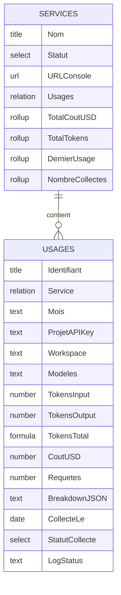

# Structure Bases de Donnees Notion Relationnelles

## Vue d'ensemble



---

## Base 1 : Services

Table de reference des providers LLM. Chaque service n'a qu'une seule entree.| Propriete | Type | Description ||-----------|------|-------------|| **Nom** | Title | Nom du service (OpenAI, Anthropic, ElevenLabs, Deepgram, OpenRouter) || **Statut** | Select | `Actif`, `Inactif`, `En attente API` || **URL Console** | URL | Lien vers la console du service || **ID Provider** | Text | ID technique (openai, anthropic, etc.) || **Notes** | Text | Informations supplementaires || **Usages** | Relation | Lien vers la base Usages (relation bidirectionnelle) || **Total Cout USD** | Rollup | `Usages.Cout USD` - Somme - Affiche le cout total cumule || **Total Tokens** | Rollup | `Usages.Tokens Total` - Somme || **Nombre Collectes** | Rollup | `Usages` - Compte le nombre d'entrees || **Derniere Collecte** | Rollup | `Usages.Collecte Le` - Date la plus recente |

### Donnees initiales a creer

Creer 5 entrees :

1. OpenAI - Actif - https://platform.openai.com
2. Anthropic - Actif - https://console.anthropic.com
3. ElevenLabs - Actif - https://elevenlabs.io
4. Deepgram - Actif - https://console.deepgram.com
5. OpenRouter - Actif - https://openrouter.ai

---

## Base 2 : Usages

Historique detaille de chaque collecte de donnees.| Propriete | Type | Description ||-----------|------|-------------|| **Identifiant** | Title | Format: `2026-01 - OpenAI - ProjectName` (genere auto) || **Service** | Relation | Lien vers la base Services || **Mois** | Text | Format: `2026-01` || **Projet/API Key** | Text | Nom du projet, API key, ou workspace si non disponible || **Workspace** | Text | ID du workspace (si applicable) || **Modeles** | Text | Liste des modeles utilises (ex: "gpt-4o, gpt-4o-mini") || **Tokens Input** | Number | Nombre de tokens en entree || **Tokens Output** | Number | Nombre de tokens en sortie || **Tokens Total** | Formula | `prop("Tokens Input") + prop("Tokens Output")` || **Cout USD** | Number | Cout en dollars (format: Dollar) || **Requetes** | Number | Nombre de requetes/appels || **Breakdown JSON** | Text | Detail complet par modele en JSON || **Collecte Le** | Date | Timestamp de la collecte (include time) || **Statut Collecte** | Select | `Succes`, `Echec`, `Partiel`, `Donnees indisponibles` || **Log Status** | Text | Messages de debug, erreurs, infos sur la recuperation |

### Exemple d'entree

```javascript
Identifiant: 2026-01 - OpenAI - Production
Service: [OpenAI]
Mois: 2026-01
Projet/API Key: proj_abc123
Workspace: production
Modeles: gpt-4o, gpt-4o-mini, text-embedding-3-small
Tokens Input: 1,250,000
Tokens Output: 450,000
Tokens Total: 1,700,000
Cout USD: $45.50
Requetes: 12,500
Breakdown JSON: [{"model":"gpt-4o","cost":40.00,"requests":5000},...]
Collecte Le: 2026-01-02 09:00
Statut Collecte: Succes
Log Status: "Collecte complete. 3 chunks traites. 45 pages paginées."
```

---

## Avantages de cette structure

1. **Rollups automatiques** : La base Services affiche toujours les totaux a jour
2. **Historique complet** : Chaque collecte est archivee avec son contexte
3. **Debug facile** : Le champ Log Status permet de diagnostiquer les problemes
4. **Flexibilite** : Fonctionne pour tous les providers (avec ou sans projets/workspaces)
5. **Dataviz Notion** : Possibilite de creer des graphiques par service, par mois, etc.

---

## Modifications du code

### Fichier `src/lib/notion.ts`

Adapter les fonctions pour :

- Rechercher/creer le service dans la base Services
- Creer les entrees d'usage dans la base Usages avec la relation
- Inclure les champs de debug (Log Status, Statut Collecte)
- Gerer les tokens input/output separement

### Variables d'environnement

```env
NOTION_SERVICES_DB_ID=xxx    # Remplace NOTION_SNAPSHOTS_DB_ID
NOTION_USAGES_DB_ID=xxx      # Remplace NOTION_SUMMARIES_DB_ID
```

---

## Procedure de creation dans Notion

### Etape 1 : Creer la base Services

1. Nouvelle page > Database - Full page
2. Nommer "Services LLM"
3. Ajouter les proprietes (voir tableau ci-dessus)
4. Creer les 5 entrees de services

### Etape 2 : Creer la base Usages

1. Nouvelle page > Database - Full page
2. Nommer "Usages LLM"
3. Ajouter les proprietes
4. Pour "Service" : choisir "Relation" > selectionner "Services LLM"
5. Activer la relation bidirectionnelle

### Etape 3 : Configurer les Rollups