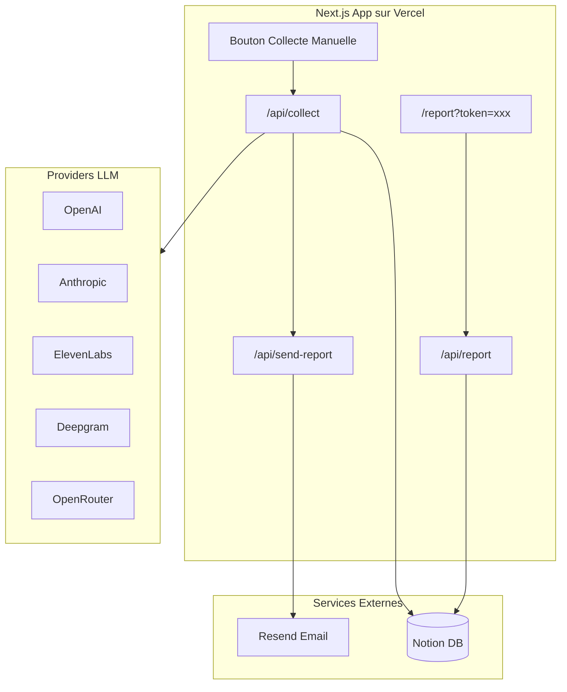

# Rapport Mensuel Automatisé avec Notion

## Architecture globale




## 1. Structure Base de Donnees Notion

Creer 2 tables dans Notion :

### Table 1 : Provider Snapshots

| Propriete | Type | Description ||-----------|------|-------------|| Month | Title | Format "2026-01" || Provider | Select | openai, anthropic, elevenlabs, deepgram, openrouter || Total Cost USD | Number | Cout total du mois || Requests | Number | Nombre total de requetes || Breakdown JSON | Rich Text | Detail par modele (JSON) || Collected At | Date | Timestamp de collecte |

### Table 2 : Monthly Summaries

| Propriete | Type | Description ||-----------|------|-------------|| Month | Title | Format "2026-01" || Total Cost USD | Number | Somme tous providers || Previous Month Cost | Number | Cout mois precedent || Change Percent | Number | Variation en % || Provider Count | Number | Nb de providers actifs || Report URL | URL | Lien vers la page de rapport |

## 2. Integration Notion (cote serveur uniquement)

Creer [`src/lib/notion.ts`](src/lib/notion.ts) :

- Client Notion initialise avec `NOTION_API_KEY`
- Fonctions CRUD pour les 2 tables
- Toutes les requetes passent par le serveur Next.js (evite CORS)

Variables d'environnement requises :

```javascript
NOTION_API_KEY=secret_xxx
NOTION_SNAPSHOTS_DB_ID=xxx
NOTION_SUMMARIES_DB_ID=xxx
```


## 3. API Route de Collecte

Creer [`src/app/api/collect/route.ts`](src/app/api/collect/route.ts) :

1. Valider le token secret (`COLLECT_SECRET_TOKEN`)
2. Recuperer le mois courant et precedent
3. Pour chaque provider actif :

- Appeler `getCosts()` pour le mois entier
- Sauvegarder dans Notion (Provider Snapshots)

4. Calculer le total agrege et la variation
5. Sauvegarder le resume dans Notion (Monthly Summaries)
6. Optionnel : declencher l'envoi d'email

## 4. Page de Rapport Agrege

Creer [`src/app/report/page.tsx`](src/app/report/page.tsx) :

- Protection par token URL (`?token=xxx`)
- Affiche pour chaque provider :
- Cout du mois
- Variation vs mois precedent (indicateur cle)
- Top modeles utilises
- Section totale agregee avec :
- Cout total tous providers
- Variation globale en %
- Graphique de repartition (optionnel)

## 5. Integration Resend

Creer [`src/lib/email.ts`](src/lib/email.ts) :

- Template email HTML avec resume des couts
- Lien vers la page de rapport complete

Creer [`src/app/api/send-report/route.ts`](src/app/api/send-report/route.ts) :

- Envoie l'email de rapport mensuel

Variable d'environnement :

```javascript
RESEND_API_KEY=re_xxx
REPORT_EMAIL_TO=votre@email.com
```


## 6. Interface de Declenchement Manuel

Modifier [`src/app/page.tsx`](src/app/page.tsx) :

- Ajouter un bouton "Collecter donnees mensuelles"
- Affiche le statut de la derniere collecte

## 7. Deploiement Vercel

- L'app fonctionne 24/7 sur Vercel (plan gratuit suffit)
- Plus tard, possibilite d'ajouter Vercel Cron (plan Pro) ou GitHub Actions pour automatiser

## Variables d'Environnement a Configurer

```env
# Notion
NOTION_API_KEY=secret_xxx
NOTION_SNAPSHOTS_DB_ID=xxx
NOTION_SUMMARIES_DB_ID=xxx

# Email
RESEND_API_KEY=re_xxx
REPORT_EMAIL_TO=votre@email.com

# Securite
COLLECT_SECRET_TOKEN=xxx
REPORT_SECRET_TOKEN=xxx
```


## Ordre d'Implementation

1. Configurer Notion (creer les bases, integration API)
2. Implementer le client Notion (`src/lib/notion.ts`)
3. Creer l'API de collecte
4. Creer la page de rapport
5. Integrer Resend pour les emails